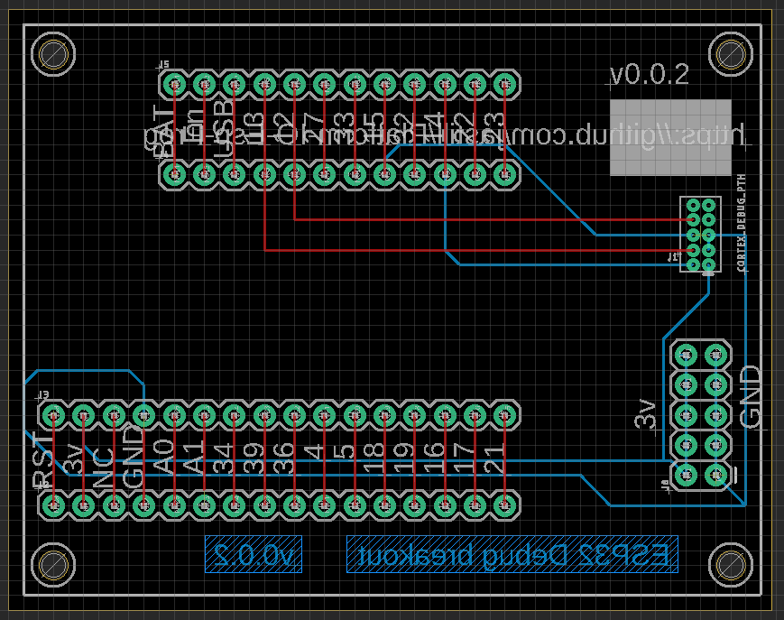
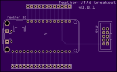
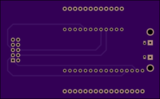

# PlatformIO ESP32 Debugging

##Platform IO ESP32 Debug Breakout Board

## PCB from [Osh Park](https://oshpark.com)

## Board

Board: [Adafruit Feather 32](https://www.adafruit.com/product/3405)

ESP [Prog Board](https://github.com/espressif/esp-iot-solution/blob/master/documents/evaluation_boards/ESP-Prog_guide_en.md)

## Misc

Step that got ESP-PROG to connect:

Bizarrely it seemed that loading and then unloading these drivers are the change that caused it to work.

https://www.ftdichip.com/Drivers/VCP.htm
sudo kextunload /Library/Extensions/FTDIUSBSerialDriver.kext

### Helpful links to get the port connected

https://docs.platformio.org/en/latest/plus/debug-tools/esp-prog.html

https://community.platformio.org/t/esp-prog-debugging-on-a-mac-no-device-found/14658 

